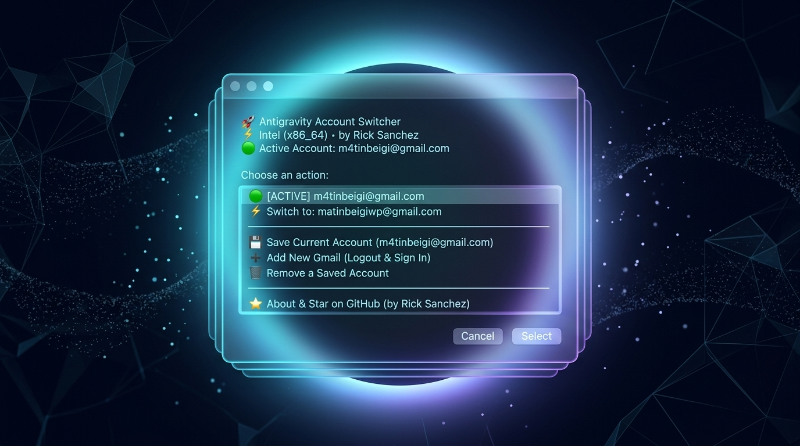
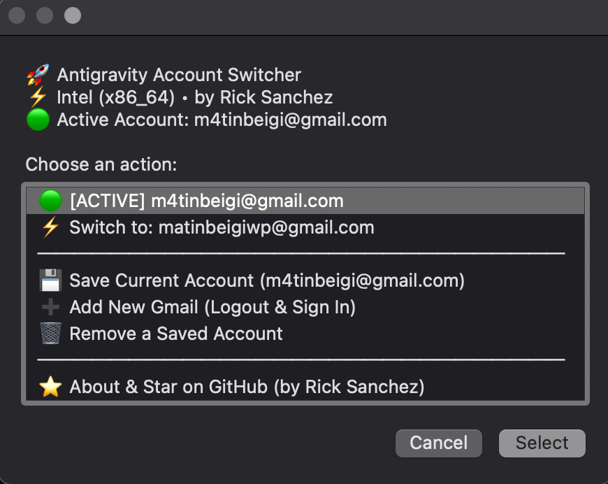

<div align="center">

# 🚀 Antigravity Account Switcher

**Super-fast, seamless 1-click Google account switcher for Google Antigravity on macOS (Intel & Apple Silicon) and Windows.**

Developed with ❤️ by **[Rick Sanchez](https://github.com/m4tinbeigi-official)**

[-black?logo=apple&style=for-the-badge)](https://apple.com)
[](https://microsoft.com)
[](https://m4tinbeigi-official.github.io/antigravity-account-switcher/)
[](LICENSE)
[](https://github.com/m4tinbeigi-official/antigravity-account-switcher)

[🌐 Live Website & Docs](https://m4tinbeigi-official.github.io/antigravity-account-switcher/) • [English](#-english) • [فارسی](#-فارسی)

<br/>



<br/><br/>

### 📸 Application Interface


</div>

---

## 👨‍💻 Creator & Author
- **Author**: Rick Sanchez
- **GitHub Profile**: [@m4tinbeigi-official](https://github.com/m4tinbeigi-official)
- **Repository**: [github.com/m4tinbeigi-official/antigravity-account-switcher](https://github.com/m4tinbeigi-official/antigravity-account-switcher)

⭐ **If you find this tool helpful, please star the repository to support further open-source development!**

---

## 🇬🇧 English

### Overview
Switching between multiple Gmail / Google accounts on **Google Antigravity** can be frustrating because session tokens are securely protected inside **macOS Keychain** or **Windows Credential Manager** (`service: "gemini"`, `account: "antigravity"`).

**Antigravity Account Switcher** is an ultra-fast, native cross-platform utility (GUI & CLI) that communicates directly with native credential managers to store, manage, and switch your Google Antigravity identities in under 3 seconds.

### ✨ Features
- ⚡️ **Instant 1-Click Switching**: Seamlessly swap between work, personal, or dev accounts.
- 📊 **Claude-Style Usage Dashboard**: Real-time quota & session limits tracker displayed in Anthropic Claude's signature aesthetic (GUI window + Claude Code terminal box).
- 🍏 **Universal macOS Support**: Native Universal 2 binary for **Apple Silicon (M1/M2/M3/M4)** and **Intel (x86_64)** with tactile sound effects and high-res icon.
- 🪟 **Native Windows 10 & 11 Support**: Direct integration with Windows Credential Manager (`advapi32.dll`) via PowerShell and WinForms UI.
- 🔒 **Zero Data Transmission**: Everything runs 100% locally on your machine. Tokens never leave your local credential store.
- 💻 **Spotlight & CLI Integration**: Run from `/Applications`, Desktop, Spotlight (`Cmd+Space`), or terminal via `agy-switch`.
- 🔄 **Safe Auto-Restart**: Seamlessly restarts Antigravity with the selected account applied.

---

### 📦 Installation & Setup

#### 🍏 macOS (Apple Silicon & Intel)
```bash
git clone https://github.com/m4tinbeigi-official/antigravity-account-switcher.git
cd antigravity-account-switcher
./install.sh
```
*Creates `AntigravitySwitcher.app` in `/Applications` and `~/Desktop`, and registers `agy-switch` in your terminal PATH.*

#### 🪟 Windows (10 & 11)
```powershell
git clone https://github.com/m4tinbeigi-official/antigravity-account-switcher.git
cd antigravity-account-switcher
.\install.bat
```
*Creates `AntigravitySwitcher.bat` on your Desktop.*

---

### 🎮 Usage

#### GUI Mode
- **macOS**: Open **`AntigravitySwitcher.app`** from Applications, Desktop, or Spotlight (`Cmd+Space`). Select **`📊 View Usage & Limits (Claude Style)`**.
- **Windows**: Double-click **`AntigravitySwitcher.bat`** on your Desktop.

#### CLI Mode
```bash
# macOS terminal:
agy-switch --usage            # 📊 Display live quota in Claude Code style
agy-switch --usage-gui        # 🖥 Open standalone Claude usage desktop window
agy-switch --list             # List saved accounts
agy-switch --switch user@gmail.com
agy-switch --save
agy-switch --logout
agy-switch --about

# Windows PowerShell:
powershell -File .\switcher_windows.ps1 -Usage   # 📊 Display live quota in Claude Code style
powershell -File .\switcher_windows.ps1 -List
powershell -File .\switcher_windows.ps1 -Switch user@gmail.com
powershell -File .\switcher_windows.ps1 -Save
powershell -File .\switcher_windows.ps1 -Logout
powershell -File .\switcher_windows.ps1 -About
```

---

## 🇮🇷 فارسی

### درباره سازنده
این ابزار توسط **[ریک سانچز (Rick Sanchez)](https://github.com/m4tinbeigi-official)** برای جامعه توسعه‌دهندگان و کاربران Google Antigravity به صورت کاملاً آزاد و متن‌باز (Open Source) توسعه داده شده است.
اگر این ابزار براتون کاربردی بود، لطفاً با **[دادن ستاره (Star ⭐) در گیت‌هاب](https://github.com/m4tinbeigi-official/antigravity-account-switcher)** از این پروژه حمایت کنید!

### معرفی
تغییر اکانت‌های گوگل در نرم‌افزار **Google Antigravity** به دلیل ذخیره‌سازی رمزنگاری‌شده در **macOS Keychain** و **Windows Credential Manager** پیچیده است.

**Antigravity Account Switcher** ابزاری کاملاً نیتیو و سبک برای **مک و ویندوز** است که مستقیماً با مدیریت اعتبار سیستم‌عامل ارتباط برقرار کرده و امکان جابه‌جایی سریع بین بی‌شمار اکانت گوگل را تنها با **یک کلیک** فراهم می‌سازد.

### 🌟 ویژگی‌های کلیدی
- ⚡️ **سوئیچ زیر ۳ ثانیه**: جابه‌جایی آنی بین اکانت‌های کاری و شخصی بدون نیاز به لاگین مجدد.
- 📊 **نمایشگر مصرف به سبک Claude**: بررسی دقیق درصد مصرف سهمیه (Quota)، سشن جاری (Current session)، زمان بازنشانی (Reset Timer) و تفکیک مدل‌ها دقیقاً مطابق ظاهر نرم‌افزار و ترمینال Claude!
- 🍏 **مک‌های سیلیکون و اینتل**: باینری دوگانه Universal 2 برای چیپ‌های سری M اپل و اینتل به همراه افکت صوتی و آیکون HD.
- 🪟 **ویندوز ۱۰ و ۱۱**: پیاده‌سازی نیتیو با PowerShell و WinForms با اتصال به `advapi32.dll` بدون نیاز به نصب پیش‌نیاز.
- 🔒 **امنیت ۱۰۰٪ آفلاین**: هیچ اطلاعاتی به هیچ سروری ارسال نمی‌شود؛ تمام داده‌ها به صورت امن در سیستم خودتان ذخیره می‌شوند.

---

### 📄 License
This project is licensed under the [MIT License](LICENSE).
